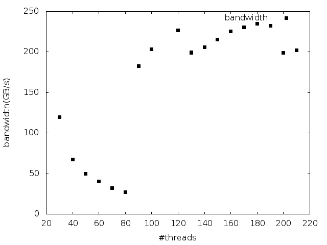

### Result

  bandwidth
30    120.333
40    68.9275
50    50.9864
60    41.5675
70    33.0201
80    27.7843
90    196.097
100    212.889
130    203.299
120    233.573
130    203.539
140    210.102
150    218.541
160    226.883
170    235.059
180    241.525
190    240.676
200    200.591
210    207.179
600164416
0.108289
768000000000
6605.05 GB/s
  bandwidth
30    119.354    
40    67.2376    
50    49.5924    
60    40.2589    
70    32.1017    
80    27.1228    
90    182.389    
100    203.689    
130     199.44    
120    226.495    
130    199.179    
140    206.118    
150    215.348    
160    225.272    
170    230.721    
180    234.863    
190    232.437    
200    199.121    
210    202.188    
